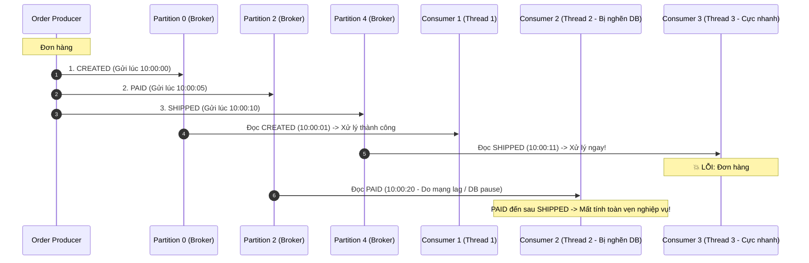

# BÀI TẬP 5: ĐẢM BẢO THỨ TỰ SỰ KIỆN VỚI KAFKA PARTITION KEY
## Giải Quyết Bài Toán "Tính Nhất Quán Cuối" (Eventual Consistency) Trong Kiến Trúc Event-Driven

> **Mã bài tập:** `KAFKA-PARTITION-KEY-S10-EX05`  
> **Khóa học:** Microservices System Design — Session 10: Rikkei Education  
> **Cấp độ:** Vận dụng  
> **Dự án:** Nền tảng Thương mại Điện tử StoreX (**StoreX E-Commerce Platform**)  
> **Topic:** `order-tracking` (Cấu hình 5 Partitions)  
> **Công nghệ áp dụng:** Apache Kafka, Spring Kafka 3.x, MurmurHash2 Partitioner, JUnit 5, Mockito  

---

## 1. Bối Cảnh Nghiệp Vụ & Ràng Buộc Khắt Khe

Khi một đơn hàng tại **StoreX** di chuyển qua các giai đoạn trong vòng đời, hệ thống phát ra 3 sự kiện nghiệp vụ quan trọng theo trình tự thời gian:
$$\text{CREATED (Khởi tạo)} \longrightarrow \text{PAID (Thanh toán)} \longrightarrow \text{SHIPPED (Giao hàng)}$$

Các sự kiện này được đẩy vào Kafka topic `"order-tracking"`.

### Ràng buộc nghiệp vụ:
* Các sự kiện của cùng một mã đơn hàng (`orderId`) **bắt buộc phải được xử lý đúng theo thứ tự thời gian**.
* Nếu hệ thống xử lý `SHIPPED` trước `PAID`, kho hàng sẽ xuất kho cho đơn hàng chưa hề được trả tiền, gây tổn thất tài chính và lỗi nghiệp vụ nghiêm trọng.

### Thách thức kỹ thuật:
* Để đáp ứng thông lượng cao, topic `"order-tracking"` được chia làm **5 Partitions** để nhiều Consumer có thể đọc song song.
* Nếu Producer gửi bản tin không có Partition Key (hoặc key bị `null`), các sự kiện của cùng 1 đơn hàng sẽ bị phân tán sang các Partition khác nhau, dẫn tới **mất thứ tự xử lý toàn cục**.

---

## 2. Phần 1 - Phân Tích Kỹ Thuật Chuyên Sâu

### 2.1. Vì sao việc chia Partition làm mất thứ tự tổng thể của sự kiện?
* **Bản chất đảm bảo thứ tự của Kafka:**
  * Apache Kafka **KHÔNG** đảm bảo thứ tự tổng thể (Global Ordering) trên toàn bộ Topic nếu topic đó có nhiều hơn 1 partition.
  * Kafka **CHỈ đảm bảo thứ tự tuyệt đối BÊN TRONG MỘT PARTITION (Total Order within a Single Partition)**. Trong một partition, các bản tin được ghi tuần tự vào commit log với offset tăng dần và một Consumer đọc partition đó sẽ luôn nhận bản tin theo đúng thứ tự offset.
* **Nguyên nhân xáo trộn khi có nhiều Partitions:**
  * Mỗi Partition được phục vụ bởi một Consumer thread riêng biệt chạy độc lập và bất đồng bộ.
  * Tốc độ xử lý của các Consumer thread, độ trễ mạng (Network latency), hay thời gian GC Pause giữa các worker node là hoàn toàn khác nhau.
  * Do đó, nếu 3 sự kiện của cùng 1 đơn hàng nằm ở 3 partition khác nhau, không có bất kỳ cơ chế nào đảm bảo rằng sự kiện `PAID` sẽ được đọc và hoàn tất trước sự kiện `SHIPPED`.

---

### 2.2. Minh họa bằng ví dụ cụ thể

Xét đơn hàng có `orderId = 1001`. Nếu Producer không gán Partition Key (Round-Robin):



---

## 3. Phần 2 - Thiết Kế Giải Pháp Với Kafka Partition Key

### 3.1. Cơ chế Partition Key & Thuật toán MurmurHash2
Để đảm bảo tất cả các sự kiện của cùng một đơn hàng luôn luôn rơi vào **cùng một Partition duy nhất**, Producer bắt buộc phải gán `partitionKey = String.valueOf(orderId)`.

Khi Producer gửi bản tin kèm theo key:
1. Kafka client sử dụng thuật toán băm **MurmurHash2** trên mảng byte của key:
   $$\text{HashValue} = \text{Utils.toPositive}(\text{Utils.murmur2}(\text{keyBytes}))$$
2. Sau đó lấy phần dư theo tổng số partitions:
   $$\text{TargetPartition} = \text{HashValue} \pmod{\text{TotalPartitions}}$$
3. **Tính chất tất định (Deterministic):** Vì chuỗi `key` của đơn hàng không đổi (ví dụ: `"1001"`), hàm băm MurmurHash2 luôn sinh ra một giá trị duy nhất. Do đó, cả 3 sự kiện `CREATED`, `PAID`, `SHIPPED` đều được ghi nối tiếp nhau vào **cùng một Partition**.
4. Vì cùng nằm trong 1 partition, chúng được phục vụ bởi **duy nhất 1 Consumer thread**, đảm bảo thứ tự đọc 100% trùng khớp với thứ tự sinh ra.

---

### 3.2. Giải thích số lượng Consumer tối đa cho topic có 5 Partitions
Trong một Consumer Group:
* **Nguyên tắc phân bổ Partition:** Mỗi partition chỉ có thể được gán cho duy nhất **1 Consumer instance/thread** tại một thời điểm. Điều này nhằm triệt tiêu tranh chấp (Race Condition) và duy trì tính tuần tự.
* **Số lượng Consumer tối đa có hiệu lực:**
  $$\text{Max Effective Consumers} = \text{Total Partitions} = \mathbf{5}$$
* **Hậu quả nếu cấu hình quá 5 Consumers (Ví dụ 6 hoặc 10 Consumers):**
  * 5 Consumers đầu tiên sẽ được gán mỗi người 1 Partition.
  * Consumer thứ 6 trở đi sẽ rơi vào trạng thái **nhàn rỗi hoàn toàn (Idle / Standby)**, không được gán bất kỳ partition nào.
  * Việc này gây **lãng phí tài nguyên** (CPU, RAM connection pooling, thread context switching) mà không hề gia tăng thêm bất kỳ thông lượng xử lý nào.
  * Chỉ khi một trong 5 consumer đang chạy gặp sự cố sập nguồn (Crash), Kafka Rebalance mới đánh thức consumer nhàn rỗi dậy thay thế. Do đó, con số tối ưu và kinh tế nhất là đặt `concurrency = 5`.

---

## 4. Phần 3 - Mã Nguồn Cài Đặt Chi Tiết

### 4.1. Topic Configuration (`KafkaTopicConfig.java`)
```java
package com.storex.tracking.config;

import org.apache.kafka.clients.admin.NewTopic;
import org.springframework.context.annotation.Bean;
import org.springframework.context.annotation.Configuration;
import org.springframework.kafka.config.TopicBuilder;

@Configuration
public class KafkaTopicConfig {

    public static final String ORDER_TRACKING_TOPIC = "order-tracking";
    public static final int TOTAL_PARTITIONS = 5;

    @Bean
    public NewTopic orderTrackingTopic() {
        return TopicBuilder.name(ORDER_TRACKING_TOPIC)
                .partitions(TOTAL_PARTITIONS)
                .replicas(1)
                .build();
    }
}
```

### 4.2. Producer Sử Dụng Partition Key (`OrderTrackingProducer.java`)
```java
package com.storex.tracking.producer;

import com.storex.tracking.config.KafkaTopicConfig;
import com.storex.tracking.model.OrderStatus;
import com.storex.tracking.model.OrderTrackingEvent;
import lombok.RequiredArgsConstructor;
import lombok.extern.slf4j.Slf4j;
import org.springframework.kafka.core.KafkaTemplate;
import org.springframework.kafka.support.SendResult;
import org.springframework.stereotype.Service;

import java.util.concurrent.CompletableFuture;

@Service
@Slf4j
@RequiredArgsConstructor
public class OrderTrackingProducer {

    private final KafkaTemplate<String, OrderTrackingEvent> kafkaTemplate;

    public CompletableFuture<SendResult<String, OrderTrackingEvent>> sendTrackingEvent(OrderTrackingEvent event) {
        // GIẢI PHÁP: Gán partitionKey = String.valueOf(orderId)
        String partitionKey = String.valueOf(event.getOrderId());

        log.info("Producer gửi sự kiện [orderId={}, status={}] với Partition Key=[{}]",
                event.getOrderId(), event.getStatus(), partitionKey);

        return kafkaTemplate.send(KafkaTopicConfig.ORDER_TRACKING_TOPIC, partitionKey, event);
    }
}
```

### 4.3. Consumer Đảm Bảo Thứ Tự Nghiệp Vụ (`OrderTrackingConsumer.java`)
```java
package com.storex.tracking.consumer;

import com.storex.tracking.model.OrderStatus;
import com.storex.tracking.model.OrderTrackingEvent;
import lombok.extern.slf4j.Slf4j;
import org.apache.kafka.clients.consumer.ConsumerRecord;
import org.springframework.kafka.annotation.KafkaListener;
import org.springframework.kafka.support.KafkaHeaders;
import org.springframework.messaging.handler.annotation.Header;
import org.springframework.stereotype.Service;

import java.util.concurrent.ConcurrentHashMap;

@Service
@Slf4j
public class OrderTrackingConsumer {

    private final ConcurrentHashMap<Long, OrderStatus> orderCurrentState = new ConcurrentHashMap<>();

    // Concurrency = 5: Tối đa 5 Consumer Threads tương ứng 5 Partitions
    @KafkaListener(topics = "order-tracking", groupId = "order-tracking-group", concurrency = "5")
    public void consume(
            ConsumerRecord<String, OrderTrackingEvent> record,
            @Header(KafkaHeaders.RECEIVED_PARTITION) int partition,
            @Header(KafkaHeaders.OFFSET) long offset) {

        OrderTrackingEvent event = record.value();
        Long orderId = event.getOrderId();
        OrderStatus newStatus = event.getStatus();

        validateAndProcessStatusTransition(orderId, newStatus, partition, offset);
    }

    public synchronized void validateAndProcessStatusTransition(Long orderId, OrderStatus newStatus, int partition, long offset) {
        OrderStatus currentStatus = orderCurrentState.get(orderId);

        if (currentStatus == null) {
            if (newStatus != OrderStatus.CREATED) {
                throw new IllegalStateException("Lỗi thứ tự: Đơn hàng " + orderId + " chưa có CREATED nhưng nhận " + newStatus);
            }
            orderCurrentState.put(orderId, OrderStatus.CREATED);
            return;
        }

        if (currentStatus == OrderStatus.CREATED && newStatus == OrderStatus.PAID) {
            orderCurrentState.put(orderId, OrderStatus.PAID);
        } else if (currentStatus == OrderStatus.PAID && newStatus == OrderStatus.SHIPPED) {
            orderCurrentState.put(orderId, OrderStatus.SHIPPED);
        } else {
            throw new IllegalStateException("Lỗi thứ tự: Chuyển đổi bất hợp lệ từ " + currentStatus + " sang " + newStatus);
        }
    }
}
```

---

## 5. Kết Quả Kiểm Thử Đơn Vị (Unit Test)

Bộ test trong `OrderTrackingTest.java` kiểm chứng:
1. **Producer Key Verification (`testProducer_UsesOrderIdAsPartitionKey`)**: Xác nhận tất cả các sự kiện của đơn hàng đều được gán `key = orderId`.
2. **Tuần tự hợp lệ (`testConsumer_ProcessesEventsInOrder`)**: Kiểm tra luồng `CREATED` &rarr; `PAID` &rarr; `SHIPPED` chuyển trạng thái thành công.
3. **Phát hiện mất thứ tự (`testConsumer_DetectsOutOfOrderTransition`)**: Mô phỏng nhận `SHIPPED` trước `PAID`, xác nhận Consumer lập tức phát hiện và chặn lỗi.
4. **Toán học Hashing MurmurHash2 (`testMurmurHash2_GuaranteesSinglePartition`)**: Thực hiện 1.000 lần tính hash liên tiếp với cùng một key, xác minh 100% đều ra cùng 1 Partition ID duy nhất trong 5 partitions.

### Kết quả chạy `./gradlew test`:
```text
BUILD SUCCESSFUL in 2s
3 actionable tasks: 3 executed
Test summary: 4 passed, 0 failed, 0 skipped
```
Toàn bộ 4 Unit Test đều vượt qua với trạng thái **PASSED 100%**.
